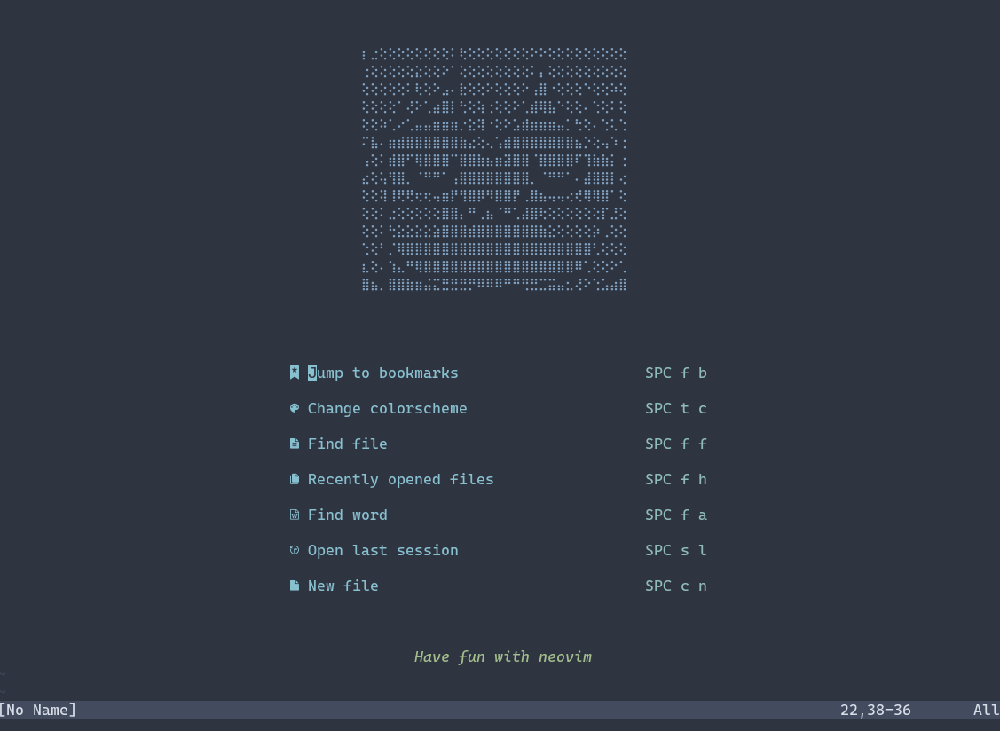
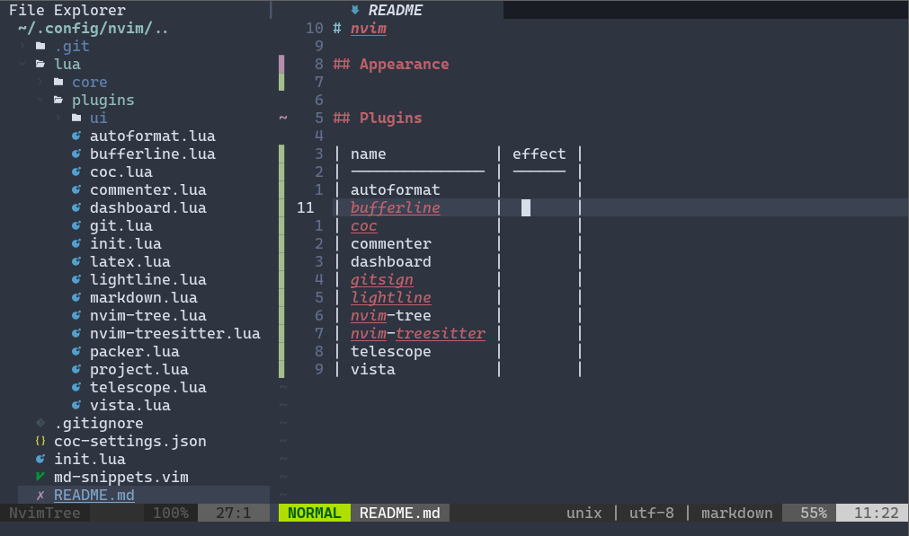

# nvim





这是我的 neovim 配置

## 配置使用

要求 neovim 的版本大于 0.5

本配置在 github 和 gitee 都有仓库，可以根据网速自行选择

```bash
git clone https://github.com/miaohn/nvim.git ~/.config/nvim
```

```bash
git clone https://gitee.com/miaohn/nvim.git ~/.config/nvim
```

在控制台输入`nvim`后，输入如下命令

```vim
:PackerSync
```

此时 Packer 就会开始下载所有插件。如果插件下不下来，那是网络的问题，需要魔法方法

## 插件列表

1. [kyazdani42/nvim-web-devicons](https://github.com/kyazdani42/nvim-web-devicons)
2. [kyazdani42/nvim-tree.lua](https://github.com/kyazdani42/nvim-tree.lua)
3. [neoclide/coc.nvim](https://github.com/neoclide/coc.nvim)
4. [liuchengxu/vista.vim](https://github.com/liuchengxu/vista.vim)
5. [mg979/vim-visual-multi](https://github.com/mg979/vim-visual-multi)
6. [junegunn/vim-easy-align](https://github.com/junegunn/vim-easy-align)
7. [Chiel92/vim-autoformat](https://github.com/Chiel92/vim-autoformat)
8. [jiangmiao/auto-pairs](https://github.com/jiangmiao/auto-pairs)
9. [norcalli/nvim-colorizer.lua](https://github.com/norcalli/nvim-colorizer.lua)
10. [folke/todo-comments.nvim](https://github.com/folke/todo-comments.nvim)
11. [terrortylor/nvim-comment](https://github.com/terrortylor/nvim-comment)
12. [mbbill/undotree](https://github.com/mbbill/undotree)
13. [puremourning/vimspector](https://github.com/puremourning/vimspector)
14. [dhruvasagar/vim-table-mode](https://github.com/dhruvasagar/vim-table-mode)
15. [yaocccc/markdown-preview.nvim](https://github.com/yaocccc/markdown-preview.nvim)
16. [520Matches/fcitx5.vim](https://github.com/520Matches/fcitx5.vim)
17. [ekickx/clipboard-image.nvim](https://github.com/ekickx/clipboard-image.nvim)
18. [rafcamlet/simple-wiki.nvim](https://github.com/rafcamlet/simple-wiki.nvim)
19. [ellisonleao/glow.nvim](https://github.com/ellisonleao/glow.nvim)
20. [mzlogin/vim-markdown-toc](https://github.com/mzlogin/vim-markdown-toc)
21. [ferrine/md-img-paste.vim](https://github.com/ferrine/md-img-paste.vim)
22. [folke/tokyonight.nvim](https://github.com/folke/tokyonight.nvim)
23. [shaunsingh/nord.nvim](https://github.com/shaunsingh/nord.nvim)
24. [itchyny/lightline.vim](https://github.com/itchyny/lightline.vim)
25. [akinsho/bufferline.nvim](https://github.com/akinsho/bufferline.nvim)
26. [glepnir/dashboard-nvim](https://github.com/glepnir/dashboard-nvim)
27. [nvim-treesitter/nvim-treesitter](https://github.com/nvim-treesitter/nvim-treesitter)
28. [nvim-lua/popup.nvim](https://github.com/nvim-lua/popup.nvim)
29. [nvim-lua/plenary.nvim](https://github.com/nvim-lua/plenary.nvim)
30. [nvim-telescope/telescope.nvim](https://github.com/nvim-telescope/telescope.nvim)
31. [nvim-telescope/telescope-media-files.nvim](https://github.com/nvim-telescope/telescope-media-files.nvim)
32. [AckslD/nvim-neoclip.lua](https://github.com/AckslD/nvim-neoclip.lua)
33. [nvim-telescope/telescope-fzf-native.nvim](https://github.com/nvim-telescope/telescope-fzf-native.nvim)
34. [fhill2/telescope-ultisnips.nvim](https://github.com/fhill2/telescope-ultisnips.nvim)
35. [mark-coyle/telescope-dbcli.nvim](https://github.com/mark-coyle/telescope-dbcli.nvim)
36. [tom-anders/telescope-vim-bookmarks.nvim](https://github.com/tom-anders/telescope-vim-bookmarks.nvim)
38. [MattesGroeger/vim-bookmarks](https://github.com/MattesGroeger/vim-bookmarks)
39. [lervag/vimtex](https://github.com/lervag/vimtex)
40. [lewis6991/gitsigns.nvim](https://github.com/lewis6991/gitsigns.nvim)
41. [nvim-lua/plenary.nvim](https://github.com/nvim-lua/plenary.nvim)
42. [kdheepak/lazygit.nvim](https://github.com/kdheepak/lazygit.nvim)
43. [vhda/verilog_systemverilog.vim](https://github.com/vhda/verilog_systemverilog.vim)
44. [liuchengxu/space-vim-theme](https://github.com/liuchengxu/space-vim-theme)
45. [rakr/vim-two-firewatch](https://github.com/rakr/vim-two-firewatch)

## 键位映射

| mode | key                | map to                                |
| ---- | ------------------ | ------------------------------------- |
| n    | `<Space>`          | `<NOP>`                               |
| n    | `;`                | `:`                                   |
| n    | `<Leader>e`        | `:NvimTreeToggle<CR>`                 |
| n    | `<Leader><Leader>` | `:set hlsearch!<CR>`                  |
| n    | `<Leader>h`        | `<C-w>h`                              |
| n    | `<Leader>j`        | `<C-w>j`                              |
| n    | `<Leader>k`        | `<C-w>k`                              |
| n    | `<Leader>l`        | `<C-w>l`                              |
| n    | `<TAB>`            | `:bnext<CR>`                          |
| n    | `<S-TAB>`          | `:bprevious<CR>`                      |
| x    | `K`                | `:move '<-2<CR>gv-gv'`                |
| x    | `J`                | `:move '>+1<CR>gv-gv'`                |
| i    | `jj`               | `<Esc>`                               |
| n    | `J`                | `5j`                                  |
| n    | `K`                | `5k`                                  |
| i    | `<expr><TAB>`      | `pumvisible()? "\\<c-n>" : "\\<TAB>"` |
| n    | `U`                | `:UndotreeToggle<CR>`                 |
| n    | `<Leader>c`        | `:CommentToggle<CR>`                  |
| v    | `<Leader>c`        | `:CommentToggle<CR>`                  |
| x    | `<Leader>c`        | `:CommentToggle<CR>`                  |
| n    | `<Leader>v`        | `:Vista!!<CR>`                        |
| n    | `<Leader>g`        | `:LazyGit<CR>`                        |
| n    | `<Leader>b`        | `:BookmarkToggle<CR>`                 |
| n    | `<Leader>B`        | `:BookmarkShowAll<CR>`                |
